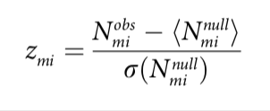

**Highlight** 
--------------

Short-term evolution in real-world networks 

Infrastructure network: Subway network, Taxi network

Social network: Twitter

**Model**
---------

Dyadic motifs: no-link dyad, one-link dyad

Triadic motifs: two -link triad, three-link triad

### **Social networks: **

node: user

link: reply 

### **Infrastructure networks: **

-for subway

node: subway station

link: individual subway line between two stations 

-for taxi

node: subway station region in Voronoi

link: region shared border 

**Voronoi Diagram** （Learned in Air Transportaion Planing） 

Z-score

"a measure of the difference in the number of motif m between in the observed network and its expected value “

Flow-based assortativity measurement

Thoughts 
---------

Subtle changes in Infrastructure network and social network can be detected on local network level, By using the real-time data, network can be detected and it is possible to publish early warning and recover rapidly after disaster.

